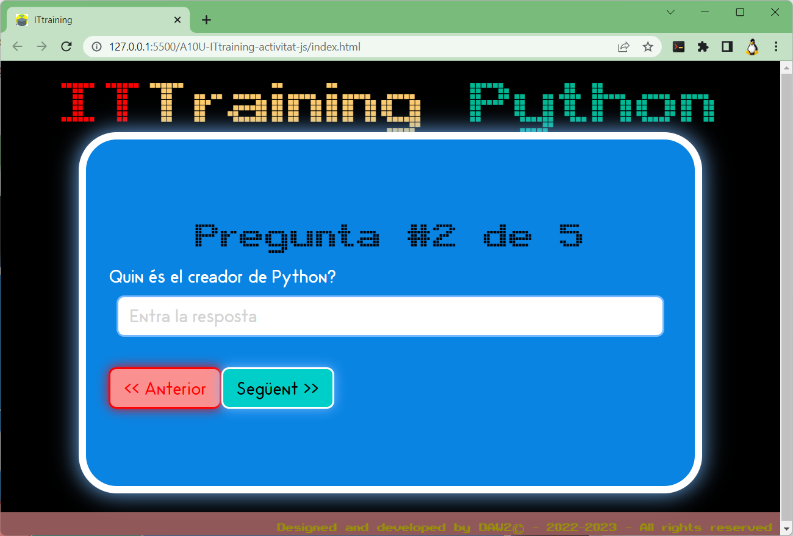
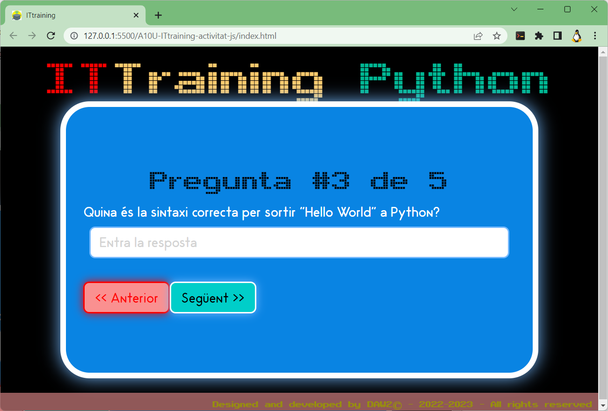
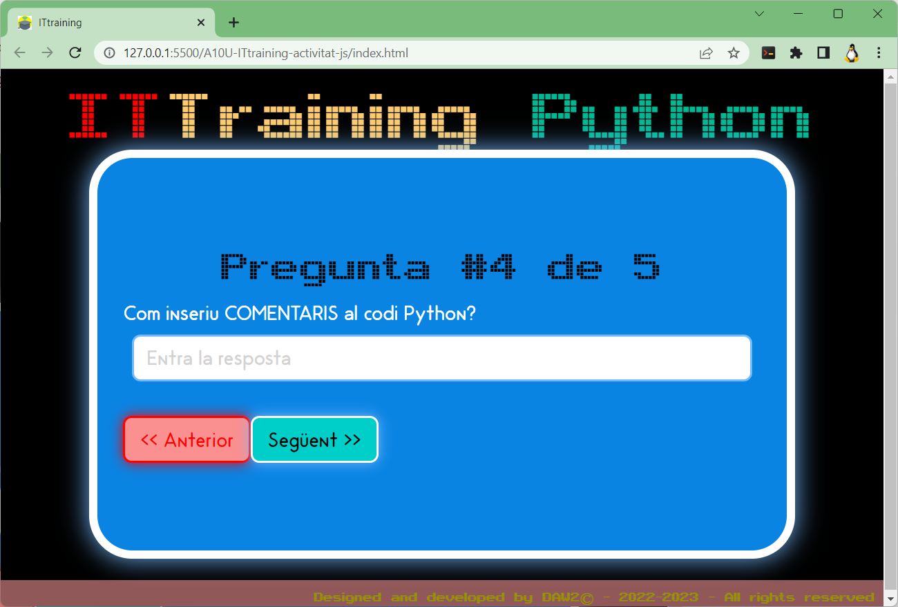
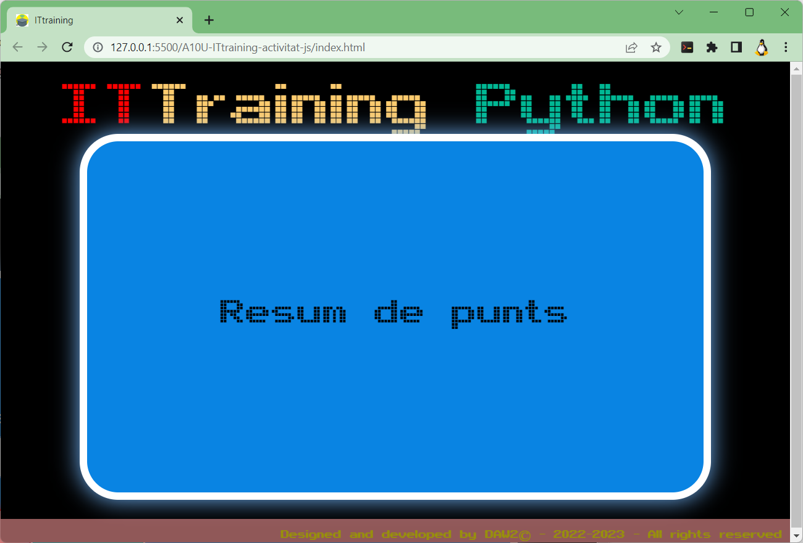

# Activitat 10: IT training

## Índex

[1. A101 - Activitat 10 (1a part): IT training](./README.md#a101---activitat-10-1a-part-it-training)

[2. A102 - Activitat 10 (2a part): IT training](./README.md#a102---activitat-10-2a-part-it-training)

[3. A103 - Activitat 10 (3a part): IT training](./README.md#a103---activitat-10-3a-part-it-training)

[4. A104 - Activitat 10 (4a part): IT training - Funció EvaluaResposta](./README.md#a104---activitat-10-4a-part-it-training---funcio-evaluaresposta)

<hr>

**ITtraining** és un portal web que té com a objectiu oferir als usuaris una sèrie de [**```serious 
games```**](https://en.wikipedia.org/wiki/Serious_game) (*jocs dissenyats amb un propòsit principal diferent del pur entreteniment*) basats en tecnologies web. A través d'aquesta web els usuaris podran demostrar els seus coneixements en **```HTML```**, **```CSS```**, **```JavaScript```**, **```Bootstrap```**, **```PHP```**, **```SQL```**, etc.

Actualment s'està treballant en el desenvolupament d'una nova versió d'aquesta aplicació, precisament per aquest motiu han contactat amb nosaltres. El disseny de la web ja està definit, però falta programar tota la funcionalitat dels jocs. Aquesta funcionalitat es programarà amb **```JavaScript```**.

La nova versió d'**```ITtraining```** ha de funcionar com una **Single-Page Application** (aplicació d'una única pàgina). La transició entre les diferents vistes també es gestionarà a través de **```JavaScript```**.

Abans de començar, decideix en quina tecnologia web estarà basat el teu **```serious games```**. Pensa en quatre possibles preguntes, tenint en compte que el mètode de resposta ha de variar (resposta oberta, seleccionar una opció, selecció múltiple, etc.). Hauràs de fer servir diferents tipus d'elements de formulari per cadascuna de les preguntes.

1. A la part superior de la web es mostra el text **```ITtraining Lorem```**. Substitueix **```Lorem```** pel nom de la tecnologia en la que es basa el teu joc (per exemple, es podria mostrar **```ITtraining HTML```**)

1. Les preguntes que vulguis fer a l'usuari estaran emmagatzemades, **de moment**, en una variable de tipus **matriu** amb la següent estructura de dades de **```JavaScript```**.

```js
    tipusPreg : "ra",
    enunciat  : "Què signifiquen les sigles HTML?",
    respostaA : "Hyper Text Markup Language",
    respostaB : "Home Tool Markup Language",
    respostaC : "Hyperlinks and Text Markup Language",
    respostaD : "Cap de les anteriors",
    correcta  : "A"
```

A on:

> **```tipusPreg```**: serà un valor entre els 4 valors possibles:
>  1. **```tx```**: La resposta serà **oberta**, per tant, l'usuari podrà respondre el que vulgui.
>  2. **```ch```**: La resposta pot tenir **més d'una** resposta possible, és a dir que l'usuari podrà escollir entre les 4 respostes que se li ofereixin.
>  3. **```ra```**: Resposta única, l'usuari només podrà escollir **una** de les 4 respostes que se li ofereixin. En aquest format podrà escollir amb el format **```HTML```** de **```radiobutton```**.
>  4. **```so```**: Resposta única, com també l'anterior, l'usuari només podrà escollir **una** de les 4 respostes que se li ofereixin. Però en aquesta ocasió es farà servir el format **```select/option ```** d'**```HTML```**, és a dir amb un menú desplegable.

1. El format en què es mostraran les preguntes, com ja s'ha comentat anteriorment, serà amb una **secció** (element **'''article'''** d'**'''HTML'''** ) per a cadascuna de les preguntes que es formulin. Ara mateix, només hi ha una secció, però caldrà que creeu ja d'entrada, tantes seccions com preguntes es formulin.

1. En canviar de pregunta has d'aconseguir que la **pregunta actual** s'amagui i aparegui la següent pregunta.

1. Les respostes facilitades per l'usuari s'hauran d'emmagatzemar en variables o estructures de dades de **```JavaScript```**. Aquesta estructura la definirà cadascú de vosaltres segons ho determini.

1. Després de l'última pregunta s'haurà de mostrar una secció addicional amb els resultats obtinguts. És a dir **respostes donades** *versus* **respostes correctes**, amb la puntuació aconseguida, missatge, etc. Aquesta secció addicional no existeix al document **```HTML```**, l'hauràs de crear tu mateix.


## Exemple

Contingut del fitxer **```preguntes.js```**`, en aquest fitxer hi ha:

### Variable **```tecnologia```**

Aquesta variable el tipus de tecnologia del vostre **```serious games```**. Per tant, caldrà que es modifiqui en començar l'execució de la pàgina.

```js
let tecnologia = "Lorem"
```


### Variable **```preguntes```**

La variable **```preguntes```**, serà de tipus matriu i caldrà que tingui:
1. l'enunciat de la pregunta,
2. les possibles respostes i
3. la resposta o respostes correctes.

El que es mostra és solament i exclusivament a títol d'exemple. No cal que sigui exacte al mostrat. El que sí que és imprescindible és que com a mínim hi hagi els quatre components esmentats (enunciat, possibles respostes i la resposta o respostes correctes).

```js
let preguntes = [
    {
        tipusPreg : "ra",
        enunciat : "Què significa HTML?",
        respostaA : "Hyper Text Markup Language",
        respostaB : "Home Tool Markup Language",
        respostaC : "Hyperlinks and Text Markup Language",
        respostaD : "Cap de les anteriors",
        correcta : "A"
      }
];
```

# Element **```article```** per una pregunta de tipus **text obert** (**```tx```**).

```html
<article id="pregunta-XX-tx">
    <span class="titol">Pregunta #???</span>
    <div class="enunciat">
        <p>Lorem ipsum dolor sit amet, consectetur adipiscing elit. Fusce hendrerit diam vitae urna pulvinar commodo. Suspendisse tristique eu justo in dignissim. Phasellus ut nibh ornare, porttitor sapien a, eleifend massa?</p>
    </div>
    <div class="respostes">
        <label class="opcio ample100">
            <input type="text" id="resp-01" name="resposta-1" placeholder="Ut enim ad minima veniam" />
        </label>
    </div>
        <button>&gt;&gt; Anterior</button>
    <button>Següent &lt;&lt;</button>
</article> <!-- FINAL <article id="pregunta-#"> -->
```


# Element **```article```** per una pregunta de tipus **checkbox** (**```ch```**).

```html
<article id="pregunta-XX-ch">
    <span class="titol">Pregunta #???</span>
    <div class="enunciat">
        <p>Lorem ipsum dolor sit amet, consectetur adipiscing elit. Fusce hendrerit diam vitae urna pulvinar commodo. Suspendisse tristique eu justo in dignissim. Phasellus ut nibh ornare, porttitor sapien a, eleifend massa?</p>
    </div>
    <div class="respostes">
        <label class="opcio ample45">
            <input type="checkbox" name="preg_XX" id="resp-XX-01"/>
            <span>Seda ut perspiciatis unde omnis</span>
        </label>
        <label class="opcio ample45">
            <input type="checkbox" name="preg_XX" id="resp-XX-02"/>
            <span>Nemo enim ipsam voluptatem quia</span>
        </label>
        <label class="opcio ample45">
            <input type="checkbox" name="preg_XX" id="resp-XX-03"/>
            <span>At vero eos et accusamus et iusto odio</span>
        </label>
        <label class="opcio ample45">
            <input type="checkbox" name="preg_XX" id="resp-XX-04"/>
            <span>Et harum quidem rerum facilis est et expedita</span>
        </label>
    </div> <!-- FINAL <div class="respostes">-->
        <button><< Anterior</button>
        <button>Següent >></button>
</article> <!-- FINAL <article id="pregunta-#"> -->
```


# Element **```article```** per una pregunta de tipus **radio button** (**```ra```**).

```html
<article id="pregunta-XX-ra">
    <span class="titol">Pregunta #XX</span>
    <div class="enunciat">
        <p>Lorem ipsum dolor sit amet, consectetur adipiscing elit. Fusce hendrerit diam vitae urna pulvinar commodo. Suspendisse tristique eu justo in dignissim. Phasellus ut nibh ornare, porttitor sapien a, eleifend massa?</p>
    </div>
    <div class="respostes">
        <label class="opcio ample45">
            <input type="radio" name="preg_XX" id="resp-XX-01"/>
        <span>Seda ut perspiciatis unde omnis</span>
        </label>
        <label class="opcio ample45">
            <input type="radio" name="preg_XX" id="resp-XX-02"/>
            <span>Nemo enim ipsam voluptatem quia</span>
        </label>
        <label class="opcio ample45">
            <input type="radio" name="preg_XX" id="resp-XX-03"/>
            <span>At vero eos et accusamus et iusto odio</span>
        </label>
        <label class="opcio ample45">
            <input type="radio" name="preg_XX" id="resp-XX-04"/>
            <span>Et harum quidem rerum facilis est et expedita</span>
        </label>
    </div> <!-- FINAL <div class="respostes">-->
        <button><< Anterior</button>
    <button>Següent >></button>
</article> <!-- FINAL <article id="pregunta-#"> -->
```


# Element **```article```** per una pregunta de tipus **```select option```** o **desplegable** (**```so```**).

```html
<article id="pregunta-XX-so">
    <span class="titol">Pregunta XX</span>
    <div class="enunciat">
        <p>Lorem ipsum dolor sit amet, consectetur adipiscing elit. Fusce hendrerit diam vitae urna pulvinar commodo. Suspendisse tristique eu justo in dignissim. Phasellus ut nibh ornare, porttitor sapien a, eleifend massa?</p>
    </div>
    <div class="respostes">
        <label class="opcio ample100">
            <select id="resp-XX">
                <option id="resp-XX-00" selected>&lt;Escull una de les següents opcions.></option>
                <option id="resp-XX-01">At vero eos et accusamus et iusto odio</option>
                <option id="resp-XX-02">Et harum quidem rerum facilis est et expedita</option>
                <option id="resp-XX-03">Temporibus autem quibusdam et aut officiis debitis</option>
            </select>
        </label>
    </div> <!-- FINAL <div class="respostes"> -->
        <button><< Anterior</button>
    <button>Següent >></button>
</article>  <!-- FINAL <article id="pregunta-#"> -->
```


<hr>
<br>

# A101 - Activitat 10 (1a part): IT training

Crear un nou repositori remot amb el nom **```<CognomAlumne>-A10U-ITtraining```**, on **```<CognomAlumne>```** és el cognom de l'alumne, sense el nom de l'alumne. És important que respecteu tant els guions com les majúscules o minúscules del nom del repositori. I cal que sigui **privat** i convideu a l'usuari **```joanpardogine```** com a col·laborador.
    
    Crear una branca amb el nom **```<CognomAlumne>-1aEntrega```**, on **```<CognomAlumne>```** és el cognom de l'alumne, sense el nom de l'alumne, en el fitxer **```README.md```** caldrà que detallis el tema (**```tecnologia```**) del teu **```serious games```**, i un mínim de 5 preguntes amb les corresponents respostes i indicant quina és la resposta correcta.

<br>
<hr>

# A102 - Activitat 10 (2a part): IT training

A partir de la branca amb el nom **```<CognomAlumne>-1aEntrega```**, crear una branca amb el nom **```<CognomAlumne>-2aEntrega```**, on **```<CognomAlumne>```** és el cognom de l'alumne, sense el nom de l'alumne. I caldrà que modifiquis el contingut del fitxer **```README.md```** per adequar el codi que tens fins ara amb les següents modificacions:
    
1. Modifica tot allò que t'ha comentat el professor a la correcció de la A101 - Activitat 10 (1a part): IT training.

2. Rectifica la variable **```correcta```** perquè sigui de tipus **```vector```**.

> Aquest canvi el proposo a causa del fet que si la pregunta és del tipus "cb" pot haver-hi més d'una > resposta, per tan, per poder emmagatzemar més d'una resposta cal que la resposta sigui del tipus > **```vector```** (**```array```**). 
> 
> ```js
>     correcta  : ["A","D"]
> ```
> 
> en comptes de:
> ```js
>     correcta  : "A","D"
> ```

3. I en el cas que la pregunta sigui del tipus "tx", no cal afegir cap contingut a les respostes, ja que la resposta és **oberta**, sinó que a la variable **```correcta```** cal afegir les paraules que **com a mínim** cal que apareguin en el text de resposta de l'usuari, per donar la resposta com a correcta!

Per exemple:
```js
    tipusPreg : "tx",
    enunciat  : "Què significa HTML?",
    respostaA : "",
    respostaB : "",
    respostaC : "",
    respostaD : "",
    correcta  : ["Hyper","Text","Markup","Language"]
```

4. Un cop fet tot això, cal que facis un **```pull request```** en el que demanaràs a l'usuari **```joanpardogine```** (**anomenant-lo**), que si us plau validi la fusió (**```merge```**), de la branca **```<CognomAlumne>-2aEntrega```** amb la **```<CognomAlumne>-1aEntrega```**.


# A103 - Activitat 10 (3a part): IT training

Abans de seguir, cal que a partir de la branca **```<CognomAlumne>-1aEntrega```**, facis un **```pull request```** a la branca **```main```**. en el que anomenaràs a l'usuari **```joanpardogine```**, no cal que demanis que et faci una revisió (**```reviewer```**). I ja tindrem tots els canvis a la  **```main```**.

Evidentment, per poder-ho fer, caldrà que l'alumne hagi fet i tingui aprovat pel professor la **A101 - Activitat 10 (1a part): IT training** i la **A102 - Activitat 10 (2a part): IT training**.

Ara sí que ho tenim tot actualitzat al **```main```**! 

## **Punt 1. 3a part**

**Cal que creis** una nova branca amb el nom **```<CognomAlumne>-3aEntrega```** des de la   **```main```**.

> # NOTA: **ÉS IMPORTANT QUE LA NOVA BRANCA **```<CognomAlumne>-3aEntrega```** LA FACIS DES DE LA BRANCA ```main```**.


## **Punt 2. 3a part**

Un cop creada la branca amb el nom **```<CognomAlumne>-3aEntrega```** cal que hi puguis TOTS els fitxers que hi ha en el meu repositori ([**```A10U-ITtraining-activitat-js```**](https://github.com/joanpardogine/A10U-ITtraining-activitat-js)).

I el que trobareu és el següent:












Com podeu veure apareixen totes les "meves" preguntes.

## **Punt 3. 3a part**

Cal que feu és que apareguin les vostres preguntes.

Dins de la funció ```function creaPregunta(index)```, des de l'inici i fins a la linia que comença amb ```// Fins aquí tots els tipus de respostes són iguals! ```, la creació de qualsevol tipus de pregunta és igual. Al igual que a partir de la linia que comença amb ```// A partir d'aquí tots els tipus de respostes TORNEN a ser iguals!``` fins al final, la creació de TOTS els tipus de pregunta és igual.

```html
    // Fins aquí tots els tipus de respostes són iguals! 

    let elementLabel = document.createElement("label");
    elementLabel.classList.add("opcio");
    elementLabel.classList.add("ample100");

    let elementInput = document.createElement("input");

    elementInput.setAttribute("type", "text");
    elementInput.setAttribute("id", `resp-0${index+1}`); // Pregunta #${index+1}
    elementInput.setAttribute("name", "resposta1");
    elementInput.setAttribute("placeholder", placeHolderEntraResposta);

    elementLabel.appendChild(elementInput);

    divResposta.appendChild(elementLabel);
        
    // A partir d'aquí tots els tipus de respostes TORNEN a ser iguals!
```


En el fitxer ```preguntes.js```, ara mateix es crea l'estructura de pregunta creant un element article com si fos per crear una pregunta de tipus ```tx```.

## **Punt 4. 3a part**

Modifica el fitxer ```preguntes.js```, perquè crei l'estructura de pregunta creant un element **```article```** tant si es tracta d'una pregunta de tipus ```tx``` (aquesta part ja la tens), com si es tracta d'una pregunta de tipus ```so```.

## **Punt 5. 3a part**

Modifica el fitxer ```preguntes.js```, perquè crei l'estructura de pregunta creant un element **```article```** tant si es tracta d'una pregunta de tipus ```tx``` (aquesta part ja la tens), com si es tracta si es tracta d'una pregunta de tipus ```ch```.

## **Punt 6. 3a part**

Modifica el fitxer ```preguntes.js```, perquè crei l'estructura de pregunta creant un element **```article```** tant si es tracta d'una pregunta de tipus ```tx``` (aquesta part ja la tens), com si es tracta si es tracta d'una pregunta de tipus ```ra```.


# A104 - Activitat 10 (4a part): IT training - Funcio EvaluaResposta

A partir de la branca amb el nom **```<CognomAlumne>-3aEntrega```**, crear una branca amb el nom **```<CognomAlumne>-4aEntrega```**, on **```<CognomAlumne>```** és el cognom de l'alumne, sense el nom de l'alumne.

Cal que facis una funció amb el nom **```<CognomAlumne>EvaluaResposta```** (on **```<CognomAlumne>```** és el cognom de l'alumne, sense el nom de l'alumne) que validarà si la resposta de l'usuari és correcte o no. Per tant, aquesta funció haurà de retornar un valor booleà en funció de si la resposta és correcta o no. De moment, només de les preguntes que no són de text (**```tx```**), ni tampoc són check box (**```ch```**), ja que és molt més fàcil. És a dir, de moment només funcionarà per aquelles preguntes que siguin de tipus **```radio button```** (**```ra```**) i **```select option```** (**```so```**).

Abans de fer res, cal que en el fitxer **```README.md```** detallis, sota el titol "## Plantejament funcio **```EvaluaResposta```**", quin plantejament seguiràs per resoldre el que se us demana.

La funció caldrà que sigui cridada quan es pressioni el botó **Següent**, de cada pregunta.

Abans de procedir amb el desenvolupament, i una vegada ja hagueu fet l'analisi i el disseny de la funció, cal que creu un **```issue```** amb el titol "**Analisi i el disseny de la funció EvaluaResposta fet!**", on cal que em mencioneu **```@joanpardogine```**. Un cop hagi avaluat l'analisi i el disseny, tancaré l'**```issue```** i podreu procerdir a fer el desenvolpament.


<hr>

# TEORIA: Definicions d'**Anàlisi** i **Disseny**

## **Anàlisi**

### Entendre que és el que ens demanen, i explicar amb les vostres paraules com ho aconseguiríeu a partir de les dades que demanareu a l'usuari.

### **Dades d'entrada**
 * Quines són les dades a partir de les quals trobareu o arribareu a allò que ens demanen.
### **Dades de sortida**
 * Quines són les dades que cal que tornarem a l'usuari com a solució final o resposta a allò que ens demanen.

### **Variables**
 * Quines són les variables, i de quin tipus són aquestes variables, que farem servir per obtenir o arribar a allò que ens demanen. 

## **Disseny**

### Fer un llistat, el més detallat possible, dels passos que seguiríeu per assolir el resultat final. En aquest procés poden aparèixer noves variables.

